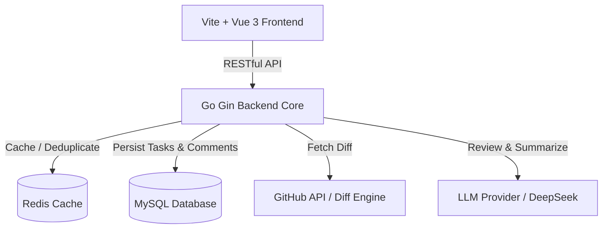

# 🤖 AI PR Reviewer - 智能代码评审助手

> **基于 Go Gin 后端与 Vue 3 / Vite 前端构建的高颜值、全功能 AI 代码合并请求审计与健康度量平台。**

本系统专为研发团队打造，通过整合 AST 抽象语法树与大语言模型（LLM）的混合上下文（Hybrid Context）检索能力，对 GitHub Pull Requests、Commits 和 Compare 分支差异进行深度的静态安全审计、性能瓶颈诊断以及规范性检查，并在仪表盘中可视化呈现项目整体健康指标。

---

## 🌟 核心功能特性

### 1. 📊 Metrics Core Dashboard (监控大盘)
- 实时监控全局代码质量与规范指标，平均健康评分多维向量化展示。
- 内置 ECharts 雷达图，实时渲染规范度、安全性、性能、可读性等健康维度。
- 动态汇总累计审计 PR 完成数、致命漏洞拦截率、上下文拉取与依赖依赖数。
- 自动提取保存在 MySQL 数据库中的最新扫描足迹与审查状态。

### 2. 🔍 PR Review Audit (智能行内评审)
- 支持输入任意标准的 GitHub Pull Request 链接，自动比对并拉取 Diff 差异。
- 多层级漏洞卡片系统（Critical 致命、Warning 警告、Suggestion 建议），精确锁定发生问题的具体文件与行号。
- 提供“一键复制代码”的 AI 修复推荐方案，支持 Side-by-Side 差异对比。

### 3. 🕸️ Hybrid Context Retriever (混合上下文关联)
- 打破传统的“单文件独立审计”模式，引入依赖拓扑与调用链追踪。
- 智能提取变更字段影响到的上游入口及下游关联，并在图中立体展示。

### 4. 🛡️ False Positive Engine (误报自适应过滤)
- 独家设计的“防噪”过滤器，允许通过定制 Prompt、匹配规则或指定标注等方式，忽略无实质风险的样式或格式变动。

### 5. ⚙️ AI Engine Configuration (引擎高级配置)
- 适配包括 DeepSeek、OpenAI、Azure 以及本地大模型在内的任意标准 OpenAI API 格式提供商。
- 支持实时在线调试、自定义 Prompt、Token 限制以及延迟响应监控。

---

## 🏗️ 架构设计与技术栈

本系统采用经典的前后端分离架构，通过高速缓存与持久化存储结合，确保高频审计的极速响应：



### 🛠️ 关键技术选型
- **前端核心**：`Vue 3.4` (Setup Sugar) + `Vite` (极速热重载构建)
- **UI 组件库**：`Element Plus` (定制化赛博朋克极光暗色主题)
- **数据可视化**：`Apache ECharts 5.5`
- **后端核心**：`Go 1.20+` + `Gin Web Framework`
- **ORM 框架**：`GORM v2` (数据库表自动动态迁移 AutoMigrate)
- **高速缓存**：`Redis 7.0` (PR Diff 缓存 1 小时，规避 GitHub API 频限)
- **数据库**：`MySQL 8.0` (持久化存储审计记录与行内批注卡片)

---

## 🚀 快速本地部署与运行

推荐通过 `docker-compose` 快速拉起基础数据库及缓存服务。

### 第一步：启动基础设施 (MySQL & Redis)
在项目根目录下执行以下命令启动 Docker 容器：
```bash
docker-compose up -d
```
> **注意**：容器启动后，将自动监听本地 `3306` (MySQL) 和 `6379` (Redis) 端口。

### 第二步：运行 Go 后端服务
1. 进入 `server` 目录：
   ```bash
   cd server
   ```
2. 配置环境变量（或在前端 Engine Config 页面配置）：
   ```bash
   # Linux/macOS
   export LLM_API_KEY="your-deepseek-api-key"
   export GITHUB_TOKEN="your-github-personal-token"
   
   # Windows PowerShell
   $env:LLM_API_KEY="your-deepseek-api-key"
   $env:GITHUB_TOKEN="your-github-personal-token"
   ```
3. 启动 Gin 后端服务器：
   ```bash
   go run main.go
   ```
   > 服务将监听 `http://localhost:8080`。当看到 `GORM tables successfully migrated` 时，说明数据库已成功完成 schema 初始化！

### 第三步：运行 Vue 前端服务
1. 打开新的终端，进入 `web` 目录：
   ```bash
   cd web
   ```
2. 安装项目依赖：
   ```bash
   npm install
   ```
3. 启动 Vite 开发服务器：
   ```bash
   npm run dev
   ```
   > 访问终端输出的地址（通常为 `http://localhost:5173`）即可开启赛博风格的代码审计之旅！

---

## 📝 研发迭代与贡献规范

为保证代码库和提交历史的高可读性，本项目实施以下研发规范：

1. **Commit Message 语义化规范**：
   - 所有的提交记录必须使用统一前缀，明示提交类型：
     - `feat: 完成某个新功能/模块`
     - `fix: 修复数据展示或逻辑 Bug`
     - `docs: 修改或补充文档说明`
     - `style: 格式、样式微调，不影响核心逻辑`
     - `refactor: 代码重构，无功能变化`
2. **分支管理与 Pull Request (PR) 流程**：
   - 禁止直接向 `main` 分支推送未经审核的代码。
   - 所有特性开发应在新分支（如 `feat/xxx`）上进行。
   - 开发完毕后发起 Pull Request，在 PR 描述中清晰描述**今日进展**与**验证通过的测试用例**。
